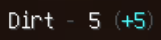
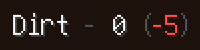

# In-Game Tests for `box-notifier-feature`

## 1. Check that notification is displayed when stock changes

- Increasing/decreasing stock by autostore, gui, commands, etc...
    - Internally, notifications are displayed by stock events from them,
      so this can be tested by checking for event firing.
    - Examples of commands
        - `/ba stock give <player> dirt 1`
        - `/ba stock take <player> dirt 1`
- Set stock by admin command (ex. `/ba stock set <player> dirt 10`)
    - If you set an amount different from the current one, a notification will be displayed.
    - If amount is same as current stock, no notification displayed.

## 2. Check that notification is displayed correctly

- Check that the item, the current stock, and the amount of change shown in the notification are correct.
    - Run `/ba stock reset <player> dirt` and do following cases.

|             Command              | Item | Current Stock | Amount of Change |
|:--------------------------------:|:----:|:-------------:|:----------------:| 
| `/ba stock give <player> dirt 5` | Dirt |       5       |        +5        |
| `/ba stock take <player> dirt 3` | Dirt |       2       |        -3        |
| `/ba stock set <player> dirt 10` | Dirt |      10       |        +8        |
| `/ba stock set <player> dirt 0`  | Dirt |       0       |       -10        |

- Verify that the notification is expected format.
    - Current format (screenshots are below): `<Item> - <Current stock> (<Amount of change>)`

### Expected notifications displayed in the game

#### When stock is increased

#### When stock is decreased

## Note: Performance

When a lager number of notifications are generated, this feature would have a negative impact on performance.
Notification is done by sending packets, so this can mainly stress the network.
