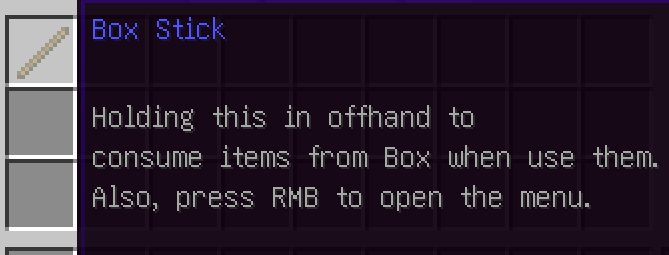

# In-Game Tests for `box-stick-feature`

## Commands

### `/box stick`

Description: Get a Box Stick (set it to the offhand).

Alias: `s`

- If the offhand is empty -> Set a Box stick to the offhand, and send a success message
  `box.stick.command.stick.success`
- If the offhand is not empty
    - Failure if:
        - The item can be used as a Box Stick -> Error message `box.stick.command.stick.already-in-offhand`
        - The inventory is full -> Error message `box.stick.command.stick.full-inventory`
    - Move the item in the offhand to the player inventory, set a Box stick to the offhand, and send a message
      `box.stick.command.stick.success`

Default Box Stick is:

### `/boxadmin customstick`

Description: Make the item in the main hand a Box Stick

- If the main hand is empty -> Error message `box.stick.command.customstick.is-air`
- The item is already Box Stick -> Error message `box.stick.command.customstick.is-stick`
- The item is not Box Stick -> Make it a Box Stick, and send a message `box.stick.command.customstick.success`

Make sure that the item can be used as a Box Stick.
